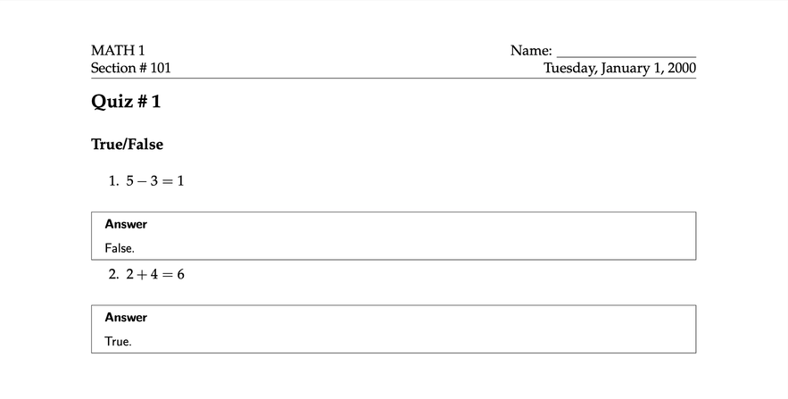
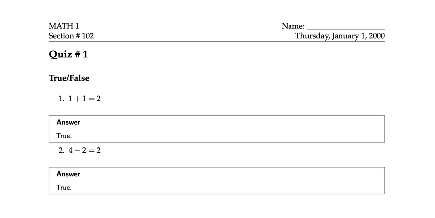

# CrissCross

CrissCross is a Markdown-centric templating engine. 

Some of its features: 

- Replace Mustache-style placeholders ``
- Include/import subfiles `!INCLUDE "subfile.md"`
- Convert to other formats using [pandoc](https://pandoc.org/) or [rmarkdown](https://github.com/rstudio/rmarkdown)

<details>
<summary>Table of Contents</summary>
- [CrissCross](#crisscross)
  - [Getting Started](#getting-started)
    - [Prerequisites](#prerequisites)
    - [Installation](#installation)
  - [Examples](#examples)
  - [Usage](#usage)
    - [Basic Usage](#basic-usage)
    - [Commands](#commands)
    - [Process](#process)
    - [Combine](#combine)
    - [File Inclusion](#file-inclusion)
  - [Roadmap](#roadmap)
  - [Built With](#built-with)
  - [Acknowledgments](#acknowledgments)
    - [Other related projects](#other-related-projects)
</details>

## Getting Started

### Prerequisites

Crisscross requires Python 3.

To convert files from one format to another, crisscross requires either [pandoc](https://github.com/jgm/pandoc), or [rmarkdown](https://github.com/rstudio/rmarkdown).


### Installation

```
pip3 install crisscross
```

## Examples

Here are some sample use cases of CrissCross, ordered by increasing complexity. 

- [Recursive Inclusion](examples/lang): Generate PDFs of the same file with keywords in different languages. 
- [Graduate School Application](examples/app): Generate personal statements customized for different schools. 
- [Quiz](examples/quiz): Generate quizzes and their solutions for 2 different sections using the same template. 
  - The examples uses `crisscross combine` to take the "Cartesian product" of different sets of YAML metadata files, and `crisscross process` to generate PDF files from them. 

Section 101 Original            |  Section 102 Original
:-------------------------:|:-------------------------:
  |  

Section 101 Solutions            |  Section 102 Solutions
:-------------------------:|:-------------------------:
  |  

## Usage

### Basic Usage

Convert `TEMPLATE.md` into PDF, using key-value pairs specified in `VARS.yaml`:

```shell
crisscross process TEMPLATE.md -y VARS.yaml -o OUTDIR/TEMPLATE.pdf
```

### Commands

There are two commands, `process` and `combine`.

### Process

`process` is the command that processes the template files. 

```
Usage: crisscross process [OPTIONS] TEMPLATES...

  Preprocess text files, and render with pandoc or rmarkdown.

Options:
  -y, --yaml PATH                 The YAML file(s) to be used. If wildcard
                                  characters are used, then the whole argument
                                  must be quoted, e.g., -y '*.yaml'.
                                  (Default: custom/*.yaml)
  --no-yaml                       Use no YAML files. In this case, key-value
                                  pairs must be supplied with -k --key-value.
                                  (Default: disabled)
  -o, --out PATH                  Schema for the path to an output file.
                                  Variables are accepted. 
                                  (Default:
                                  docs/{{id}}.pdf)
  --open-ren / --no-open-ren      Whether to open the rendered files
                                  automatically. 
                                  (Default: enabled)
  --open-text / -no-open-text     Whether to open the generated text files
                                  automatically. 
                                  (Default: disabled)
  -a, --args TEXT                 A string of arguments to be passed on to
                                  pandoc. Passing arguments to rmarkdown not
                                  supported. If there are spaces, the string
                                  should be quoted.
  -r, --render [pandoc|rmarkdown]
                                  Render using vanilla pandoc or rmarkdown, or
                                  do not render at all. 
                                  (Default: pandoc)
  --no-render                     Do not render the files with pandoc or
                                  rmarkdown. Only do variable substitution or
                                  file inclusion. 
                                  (Default: disabled)
  --include-tag [include|import]  Syntax for file inclusion. Either !INCLUDE
                                  "filename" or @import "filename". 
                                  (Default:
                                  include)
  -V, --variable TEXT             A key-value pair separated by ":". No spaces
                                  allowed. Can be used in conjunction with or
                                  in place of YAML files.
  -f, --force                     Suppress warnings. 
                                  (Default: disabled)
  -q, --quiet / -v, --verbose     Suppress messages. 
                                  (Default: disabled)
  -h, --help                      Show this message and exit.
```

### Combine

`combine` is a helper command takes the "Cartesian product" of lists of files. 

```shell
Usage: crisscross combine [OPTIONS] [FILES]...

  Generate the 'Cartesian product' of multiple files.

Options:
  -o, --out DIRECTORY          Output directory.
  -s, --separator TEXT         Character used to join the names of input
                               files.
  -q, --quiet / -v, --verbose  Suppress messages. 
                               (Default: disabled)
  -h, --help                   Show this message and exit.
```

### File Inclusion

Two inclusion tags are supported:

- `!INCLUDE "foo.md"`, in the style of [Markdown Preprocessor](https://github.com/jreese/markdown-pp#includes), and
- `@import "foo.md"`, in the style of [Markdown Preview Enhanced](https://shd101wyy.github.io/markdown-preview-enhanced/#/file-imports)
  - However, unlike MPE, CrissCross does not support `<!-- @import "foo.md" -->`. 

Adding `asis` after the inclusion tag will tell CrissCross to include the file as is, and not to further process it: `!INCLUDE asis "foo.md"`

## Roadmap

-[] Add the option to render inline placeholders as is
-[] Add logic support

## Built With

This project uses the following open source libraries.

- [pallets/click](https://github.com/pallets/click): Python composable command line interface toolkit
- [hackebrot/poyo](https://github.com/hackebrot/poyo): A lightweight YAML Parser for Python
- [noahmorrison/chevron](https://github.com/noahmorrison/chevron): A Python implementation of mustache

## Acknowledgments

This project is heavily inspired by:

- [alpianon/include-pandoc](https://github.com/alpianon/include-pandoc): A wrapper for pandoc to pre-process includes
- [michaelstepner/pandoc-mustache](https://github.com/michaelstepner/pandoc-mustache): Pandoc filter for variable substitution using Mustache syntax
  
### Other related projects

- [jreese/markdown-pp](https://github.com/jreese/markdown-pp): Preprocessor for Markdown files to generate a table of contents and other documentation needs
- [DCsunset/pandoc-include](https://github.com/DCsunset/pandoc-include): Pandoc filter to allow file includes
- [owickstrom/pandoc-include-code](https://github.com/owickstrom/pandoc-include-code): A Pandoc filter for including code from source files
- [MrToph/pandoc-code-file-filter](https://github.com/MrToph/pandoc-code-file-filter): A filter for pandoc to include sections of code from a file
